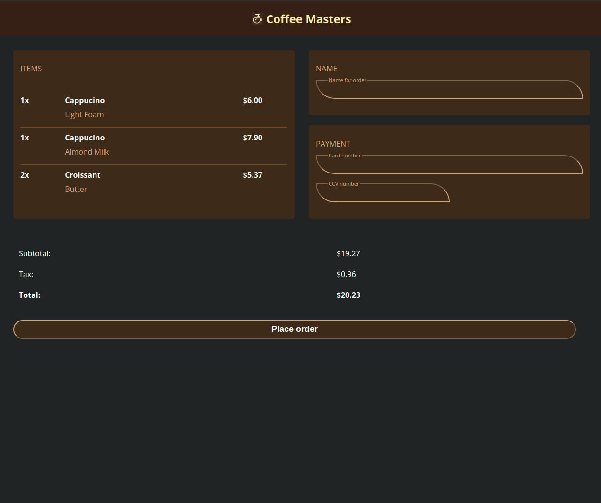
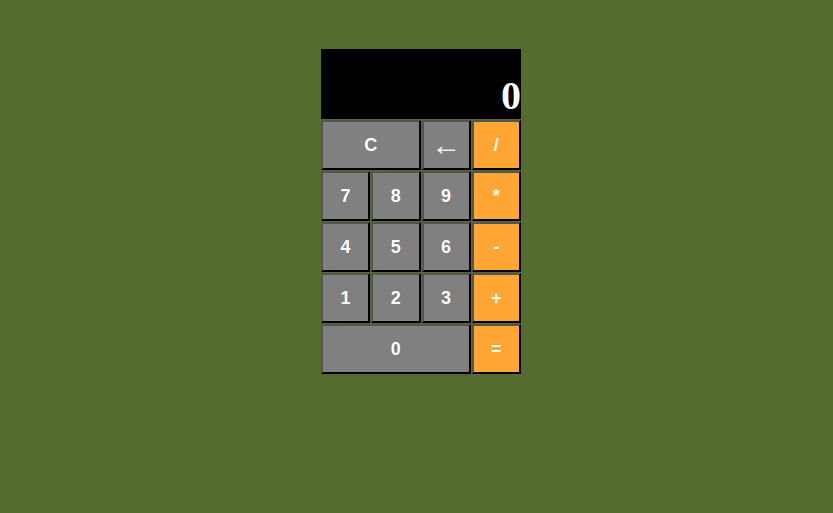
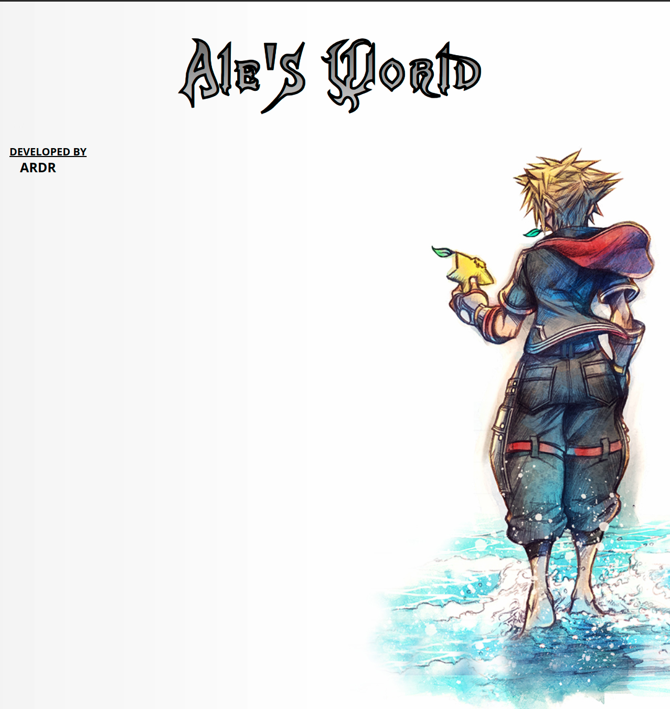
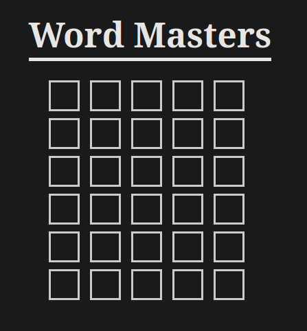

# frontend-intro

Finally getting around to learning some frontend lol. 
Started taking some courses from [frontendMasters](frontendmasters.com)

## checkoutPage
This is a simple checkout page for coffee masters page.

## combiningEverything
This is a simple calculator app. Made with js, html, and css.
I just made it work, I'll cleanup the code later :) 

## myPage
Starting to create my very own page as my side project.
**UNDER CONSTRUCTION**

## wordMaster
Final project of Brian Holt's "Complete Intro to Web Develpment, v3". 
This is a wordle game. Core purpose is to learn how to call APIs with JS.
Still a bit work is left, but the main functionality of guessing the correct 
word and checking if it is a valid guess or not works just fine. 

